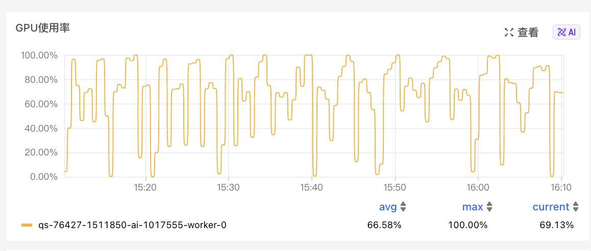

# DeepEyes RL (Multi-turn VLM Tool Use)

本示例将 DeepEyes 奖励函数和多轮工具环境（zoom/rotate）集成到 `Relax` 框架中，用于训练视觉语言模型（VLM）的工具使用能力。

## 概述

DeepEyes 是一个多轮交互式视觉问答环境，模型可以通过调用工具（如缩放、旋转图像）来更好地理解和回答问题。

## 核心组件

### 1. 多轮 Rollout

- **模块**: `examples.deepeyes.rollout.generate`
- **功能**: 实现自定义的多轮交互式采样逻辑

### 2. 交互环境

- **文件**: `env_deepeyes.py`
- **功能**:
  - 解析模型输出的 `<tool_call>{...}</tool_call>` 格式
  - 返回 `<tool_response>...</tool_response>` 和更新后的图像
  - 支持工具：缩放（zoom）、旋转（rotate）等

### 3. 奖励函数

- **文件**: `reward_deepeyes.py`
- **功能**:
  - 基于 judge 模型的答案质量评分
  - 工具调用格式正确性检查
  - 综合奖励计算

## 快速开始

### 运行训练

```bash
cd /path_to/Relax/scripts
bash benchmark.sh run_deepeyes
```

或安装benchmark.sh 中的依赖后，直接运行：

```bash
bash examples/deepeyes/run_deepeyes.sh
```

在单机 8×H800（80GB）上运行 `run_deepeyes.sh` 时的 GPU 使用率监控（平均约 66%）：



## 文件结构

```
examples/deepeyes/
├── README.md              # 本文档
├── run_deepeyes.sh        # 训练启动脚本
├── base_env.py            # 环境实现基类
├── env_deepeyes.py        # 环境实现
├── reward_deepeyes.py     # 奖励函数实现
└── rollout.py             # 多轮采样逻辑

```
